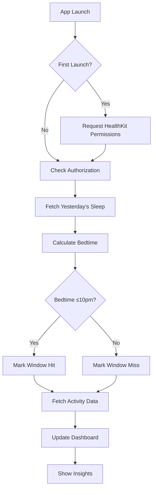

# Apple Health Integration Workflow

## Overview

This document outlines how to integrate the Belly Fat Sleep Tracker assistant app with Apple HealthKit to automatically sync sleep data, activity metrics, and health measurements.

---

## 1. Required HealthKit Permissions

### Sleep Data (Required)
```swift
let sleepType = HKObjectType.categoryType(forIdentifier: .sleepAnalysis)!
let sleepGoalType = HKObjectType.quantityType(forIdentifier: .sleepAnalysis)!
```

**Permission Description**: "Allow access to sleep data to track your 10pm-2am window adherence"

### Optional Health Data Types

| Data Type | Identifier | Purpose |
|-----------|------------|---------|
| Step Count | `.stepCount` | Activity correlation with sleep |
| Distance Walking | `.distanceWalkingRunning` | Exercise impact analysis |
| Heart Rate | `.heartRate` | Recovery metrics |
| Body Mass | `.bodyMass` | Weight tracking |
| Waist Measurement | Custom (see below) | Visceral fat proxy |
| Caffeine | `.dietaryCaffeine` | Sleep disruption tracking |

---

## 2. Data Flow Architecture

```
┌─────────────────────────────────────────────────────────────┐
│                    Apple HealthKit                          │
│  ┌──────────────┐  ┌──────────────┐  ┌──────────────┐    │
│  │ Sleep Analysis│  │ Step Count   │  │ Heart Rate   │    │
│  │ (HKCategory)  │  │ (HKQuantity) │  │ (HKQuantity) │    │
│  └──────────────┘  └──────────────┘  └──────────────┘    │
└─────────────────────────┬───────────────────────────────────┘
                          │
                          ▼
┌─────────────────────────────────────────────────────────────┐
│              Belly Fat Sleep Tracker App                    │
│                                                             │
│  ┌─────────────────────────────────────────────────────┐   │
│  │               HealthKit Manager                        │   │
│  │  - Request permissions                                │   │
│  │  - Read sleep data                                    │   │
│  │  - Read activity metrics                              │   │
│  │  - Write custom metrics (waist, wind-down)            │   │
│  └─────────────────────────────────────────────────────┘   │
│                                                             │
│  ┌─────────────────────────────────────────────────────┐   │
│  │              Data Processing Layer                   │   │
│  │  - Parse sleep stages (in-bed, asleep, awake)       │   │
│  │ - Calculate bedtime, wake time, total sleep          │   │
│  │  - Identify 10pm-2am window hits                    │   │
│  └─────────────────────────────────────────────────────┘   │
│                                                             │
│  ┌─────────────────────────────────────────────────────┐   │
│  │              Tracker Core                             │   │
│  │  - Compare actual vs target bedtime                   │   │
│  │  - Calculate wind-down adherence                      │   │
│  │  - Generate insights and recommendations              │   │
│  └─────────────────────────────────────────────────────┘   │
└─────────────────────────────────────────────────────────────┘
```

---

## 3. Implementation Steps

### Step 1: Request Permissions (Swift)

```swift
import HealthKit

class HealthKitManager {
    let healthStore = HKHealthStore()
    
    func requestPermissions(completion: @escaping (Bool) -> Void) {
        // Sleep Analysis
        let sleepType = HKObjectType.categoryType(forIdentifier: .sleepAnalysis)!
        
        // Optional: Steps
        let stepType = HKQuantityType.quantityType(forIdentifier: .stepCount)!
        
        // Optional: Heart Rate
        let heartRateType = HKQuantityType.quantityType(forIdentifier: .heartRate)!
        
        let healthTypesToRead: Set<HKObjectType> = [sleepType, stepType, heartRateType]
        let healthTypesToShare: Set<HKSampleType> = [] // We write custom data
        
        healthStore.requestAuthorization(toShare: healthTypesToShare, 
                                         read: healthTypesToRead) { (success, error) in
            completion(success)
        }
    }
}
```

### Step 2: Read Sleep Data

```swift
func fetchSleepData(for date: Date, completion: @escaping ([HKSleepAnalysisSample]?) -> Void) {
    let sleepType = HKObjectType.categoryType(forIdentifier: .sleepAnalysis)!
    let predicate = HKQuery.predicateForSamples(
        withStart: Calendar.current.startOfDay(for: date),
        end: Calendar.current.date(byAdding: .day, value: 1, to: Calendar.current.startOfDay(for: date))!,
        options: []
    )
    
    let query = HKSampleQuery(
        sampleType: sleepType,
        predicate: predicate,
        limit: HKObjectQueryNoLimit,
        sortDescriptors: nil
    ) { _, samples, _ in
        let sleepSamples = samples as? [HKCategorySample]
        completion(sleepSamples)
    }
    
    healthStore.execute(query)
}
```

### Step 3: Process Sleep Stages

```swift
enum SleepStage: String, CaseIterable {
    case inBed = "In Bed"
    case asleep = "Asleep"
    case awake = "Awake"
}

struct SleepSummary {
    let bedtime: Date?
    let waketime: Date?
    let totalSleep: TimeInterval
    let timeInBed: TimeInterval
    let deepSleep: TimeInterval
    let hitWindow: Bool // 10pm-2am
}

func calculateSleepSummary(samples: [HKCategorySample]) -> SleepSummary {
    var bedtime: Date?
    var waketime: Date?
    var totalSleep: TimeInterval = 0
    var timeInBed: TimeInterval = 0
    var deepSleep: TimeInterval = 0
    
    for sample in samples.sorted(by: { $0.startDate < $1.startDate }) {
        let stage = SleepStage(rawValue: sample.valueDescription) ?? .awake
        let duration = sample.endDate.timeIntervalSince(sample.startDate)
        
        switch stage {
        case .inBed:
            timeInBed += duration
            if bedtime == nil { bedtime = sample.startDate }
            waketime = sample.endDate
        case .asleep:
            totalSleep += duration
        case .awake:
            break
        }
    }
    
    // Check if 10pm-2am window was hit
    let hitWindow = checkWindowHit(bedtime: bedtime, waketime: waketime)
    
    return SleepSummary(
        bedtime: bedtime,
        waketime: waketime,
        totalSleep: totalSleep,
        timeInBed: timeInBed,
        deepSleep: deepSleep,
        hitWindow: hitWindow
    )
}

func checkWindowHit(bedtime: Date?, waketime: Date?) -> Bool {
    guard let bedtime = bedtime, let waketime = waketime else { return false }
    
    let tenPM = Calendar.current.nextDate(
        after: bedtime,
        matching: DateComponents(hour: 22, minute: 0),
        matchingPolicy: .nextTime
    )!
    
    let twoAM = Calendar.current.nextDate(
        after: tenPM,
        matching: DateComponents(hour: 2, minute: 0),
        matchingPolicy: .nextTime
    )!
    
    return bedtime <= twoAM && waketime >= tenPM
}
```

### Step 4: Write Custom Metrics

```swift
func saveWaistMeasurement(_ measurement: Double, at date: Date) {
    let waistType = HKQuantityType.quantityType(forIdentifier: .bodyMass)!
    // Note: Use custom metadata for waist since it's not a standard type
    
    let waistUnit = HKUnit.inch()
    let quantity = HKQuantity(unit: waistUnit, doubleValue: measurement)
    
    let metadata: [String: Any] = [
        HKMetadataKeyExternalUUID: "waist_measurement_\(date.timeIntervalSince1970)",
        "MeasurementType": "Waist"
    ]
    
    let sample = HKQuantitySample(
        type: waistType,
        quantity: quantity,
        start: date,
        end: date,
        metadata: metadata
    )
    
    healthStore.save(sample) { _, _ in }
}
```

---

## 4. Data Mapping

### Sleep Data Mapping

| HealthKit Field | App Tracking |
|-----------------|--------------|
| `sleepAnalysis` category | Bedtime ≤10pm target |
| `inBed` stage | Time in bed calculation |
| `asleep` stage | Actual sleep duration |
| `awake` stage | Sleep efficiency |

### Activity Data Mapping

| HealthKit Field | App Use |
|-----------------|---------|
| `stepCount` | Daily activity level |
| `distanceWalkingRunning` | Movement correlation |
| `heartRate` | Recovery metrics |

### Custom Data (Write to HealthKit)

| App Data | HealthKit Type | Metadata |
|----------|----------------|----------|
| Wind-down completion | Custom category | Steps completed |
| Waist measurement | Quantity (custom) | Body measurement |
| Energy level (1-10) | Quantity | subjective_score |

---

## 5. Daily Sync Workflow



---

## 6. Edge Cases

### 1. Sleep Data Unavailable
- **Fallback**: Manual entry mode
- **Prompt**: "Connect HealthKit for automatic sleep tracking"

### 2. Multiple Sleep Sessions
- **Logic**: Use the longest sleep session as primary
- **Handle**: Naps during the day

### 3. Time Zone Changes
- **Solution**: Use `HKMetadataKeyTimeZone` for all samples
- **Store**: Local time alongside UTC

### 4. Weekend Sleep-Ins
- **Detection**: Compare weekday vs weekend bedtime
- **Insight**: "Weekend sleep-in detected - plan for Monday"

---

## 7. Privacy & Security

### Data Handling
- All HealthKit data remains on-device
- No cloud sync unless user explicitly enables backup
- App transparent about what data is accessed

### Permission Descriptions (Info.plist)
```xml
<key>NSHealthShareUsageDescription</key>
<string>Track your sleep window adherence and correlate with activity to optimize your belly fat loss journey.</string>

<key>NSHealthUpdateUsageDescription</key>
<string>Save your waist measurements and wind-down progress to consolidate your health data.</string>
```

---

## 8. Testing Checklist

- [ ] Request permissions on first launch
- [ ] Read sleep analysis data
- [ ] Calculate bedtime correctly (handle multiple nights)
- [ ] Detect 10pm-2am window hits
- [ ] Handle missing sleep data gracefully
- [ ] Write custom metrics to HealthKit
- [ ] Handle background app refresh
- [ ] Test on device with Health app data

---

## 9. Sample Code Repository Structure

```
BellyFatTracker/
├── HealthKit/
│   ├── HealthKitManager.swift
│   ├── SleepAnalyzer.swift
│   ├── ActivityReader.swift
│   └── CustomDataWriter.swift
├── Models/
│   ├── SleepSummary.swift
│   └── HealthMetric.swift
├── ViewModels/
│   └── DashboardViewModel.swift
└── Utilities/
    └── HealthKitPermissions.swift
```

---

## 10. Apple Silicon Mac Considerations

- HealthKit not available on macOS (except via iOS app)
- Use Mac Catalyst for iOS app on Mac
- Consider separate macOS app with different data sources

---

## Sources

1. [Apple HealthKit Documentation](https://developer.apple.com/documentation/healthkit)
2. [HKCategoryTypeIdentifier.sleepAnalysis](https://developer.apple.com/documentation/healthkit/hkcategorytypeidentifier/sleepanalysis)
3. [Reading Data from HealthKit](https://developer.apple.com/documentation/healthkit/reading-data-from-healthkit)