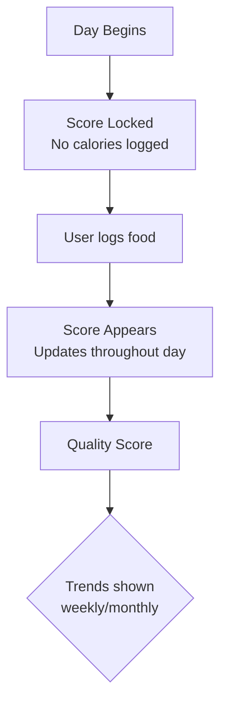
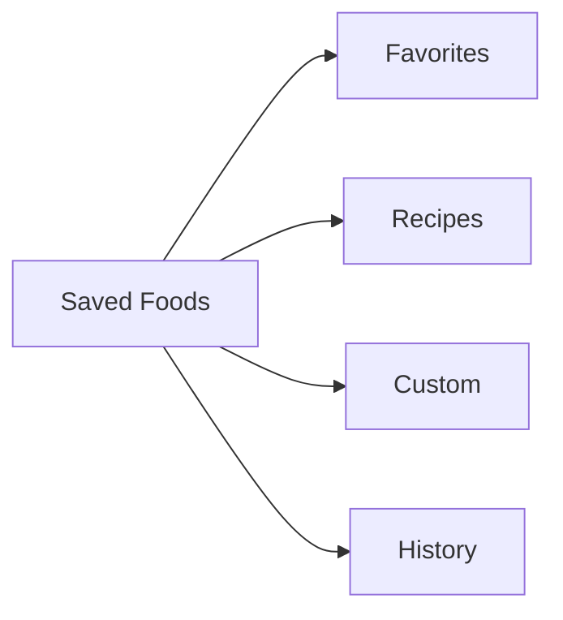
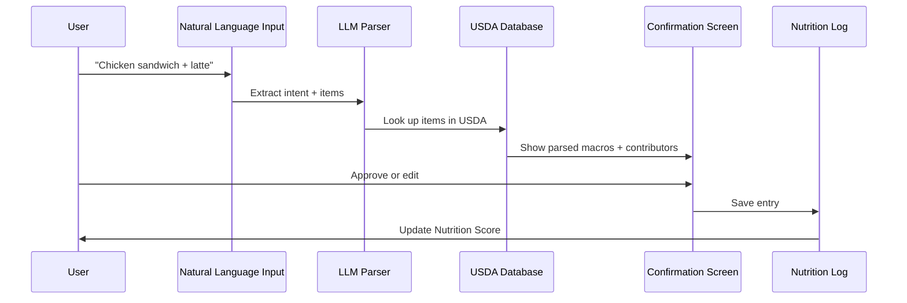

# Nutrition Data Entry Reference Analysis
## General Model Based on Evidence-Based Nutrition Scoring

> ⚠️ **Proprietary Notice:** Specific point values (+10/-5/-10), exact daily thresholds, and the "Food Quality Contributors" branding are proprietary to Bevel Health. This document describes the **general concept** for educational purposes and includes our own implementation recommendations.

---

## Executive Summary

Research-backed nutrition scoring systems can provide **holistic food quality metrics** beyond simple calories. Key concepts for our integrated app:

| Feature | General Approach | Our Implementation |
|---------|------------------|-------------------|
| **Data Entry** | Search, barcode, manual, recipes | Natural language (Anfold-style) + fallback to search/barcode |
| **Scoring** | Quality-based score (research-backed) | Custom implementation based on dietary guidelines |
| **Categories** | Evidence-based food groups | Simplified contributor model |
| **My Foods** | Saved foods for quick re-entry | Favorites + quick phrases |
| **CGM Integration** | Optional glucose impact | Future phase; not required at launch |

---

## Evidence-Based Scoring Approach

### Core Concept
A **daily quality score (typically 1-100)** that reflects eating patterns based on scientific consensus (such as AHEI, USDA guidelines, and WHO recommendations).

### Components
1. **Quality Indicators** (primary)
2. **Optional Biometrics** (future, e.g., CGM data)

---

## Evidence-Based Nutrition Categories

### Positive Categories (Research-Backed)
| Category | General Guidance | Daily Target Range |
|----------|-----------------|-------------------|
| Vegetables | Whole, minimally processed | Multiple cups recommended |
| Fruits | Whole fruits, fiber-rich | Multiple cups recommended |
| Whole Grains | High-fiber carbohydrates | Several servings |
| Healthy Fats | Unsaturated fats | 20-35% calories |
| Plant Proteins | Nuts, seeds, legumes | ~1 oz equivalents |
| Omega-3s | Essential fatty acids | ~250mg target |

### Limiting Categories (Consensus Thresholds)
| Category | Recommended Limitation |
|----------|-----------------------|
| Red/Processed Meats | Limited intake recommended |
| Alcohol | Moderation guidelines apply |
| Sodium | Below 2300mg/day recommended |
| Added Sugar | Below 10% daily calories |

> **Note:** Specific point values and exact thresholds vary by scoring system. Bevel uses a particular proprietary algorithm; we would implement our own based on WHO/USDA guidelines.

---

## Saved Foods System (Based on Industry Patterns)

Standard categories for quick re-entry:

### Entry Methods
1. **Search** - Find foods in database
2. **Barcode scan** - Quick lookup
3. **Manual/Custom** - For foods not in database
4. **Recipe creation** - Combine multiple foods

---

## Comparison: Our App vs Reference Model

| Aspect | Reference Model | Our Proposed Integration |
|--------|-----------------|-------------------------|
| **Input Style** | Search + barcode | Natural language (Anfold style) |
| **Scoring Transparency** | Research-backed | Show tier levels (verified/transformed/estimated) |
| **Saved Foods** | Favorites/Recipes/Custom/History | Merge with quick phrases |
| **Data Sources** | USDA + proprietary | USDA FoodData Central (free) |
| **CGM Integration** | Optional glucose impact | Future phase; not required at launch |
| **Focus** | Quality over quantity | Quality + recovery correlation |

---

## Recommended Nutrition Entry Flow

---

## Transparency Tier Model (Adopted from Anfold)

| Tier | Meaning | Example |
|------|---------|---------|
| **Tier 1 - Verified** | Exact USDA match | "Chicken breast, grilled" |
| **Tier 2 - Transformed** | USDA data with transformations | "Chicken wrap" (estimated from components) |
| **Tier 3 - Estimated** | AI guess with confidence | "Unknown restaurant dish" |

---

## Key Takeaways for Integration

1. **Keep the 10 contributors** — proven research model
2. **Add skip-day support** for nutrition goals (from Habit Pocket)
3. **Prioritize natural language entry** over search barriers
4. **Show score update in real-time** as food is logged
5. **Store all entries locally** for privacy (from Altianly)

---

*Source: Publicly available nutrition scoring research, USDA guidelines, WHO recommendations*  
*Date analyzed: 2026-06-30*