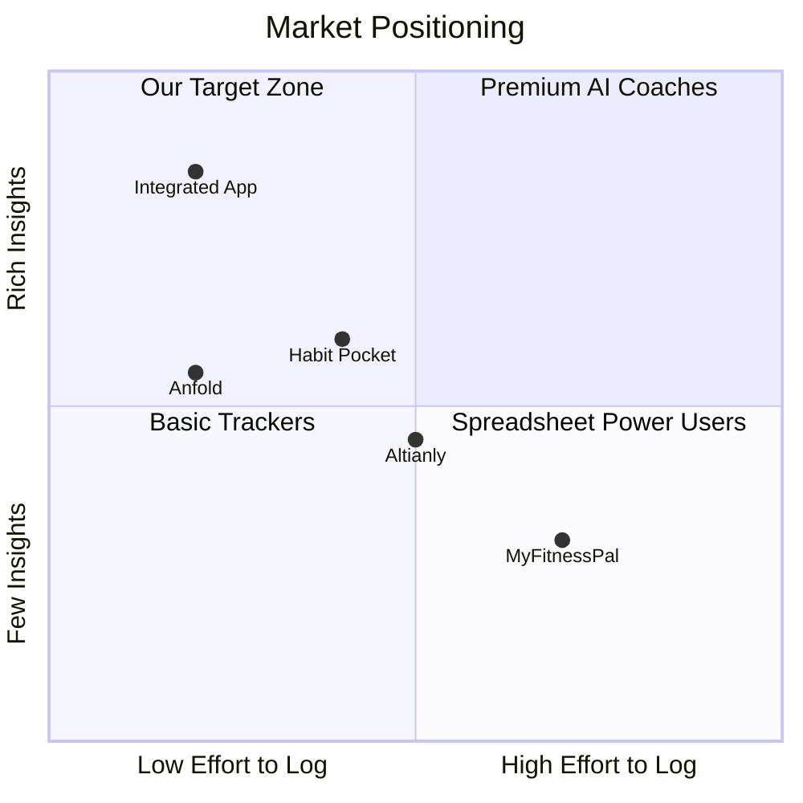
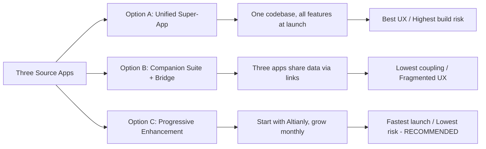
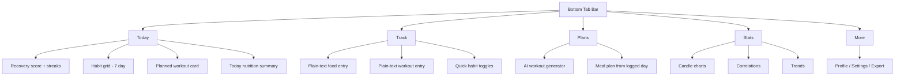
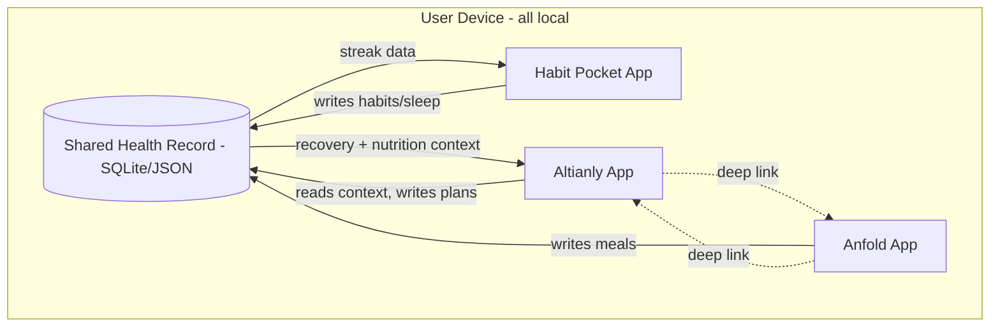
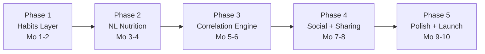
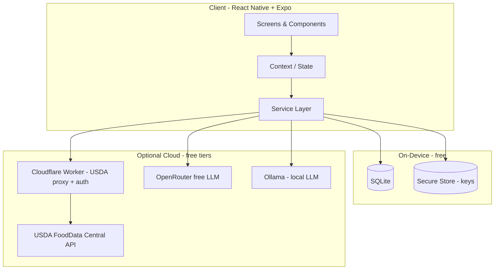
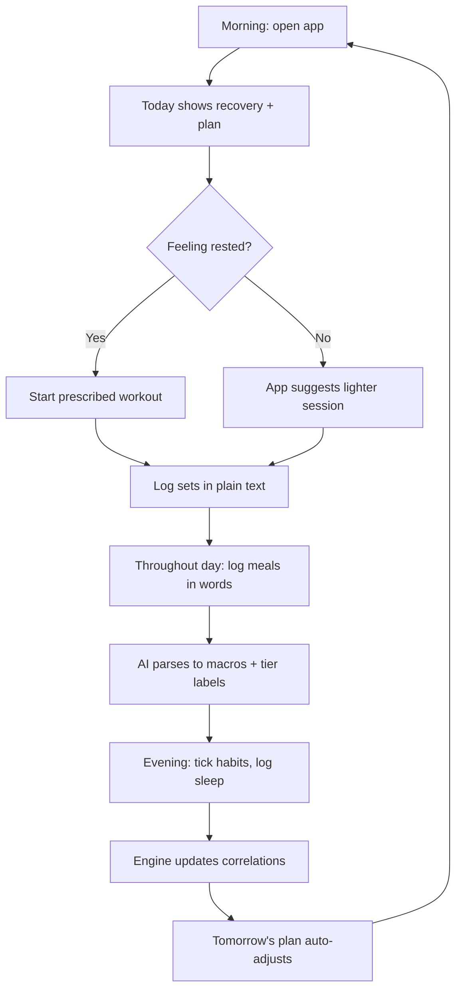

# Integrated Health App — Comprehensive Integration & Build Plan
### A Zero-Budget Business Analysis Report for Management & Technical Teams

**Prepared by:** Business Analysis Team  
**Date:** 2026-06-29  
**Version:** 2.0 (Comprehensive)  
**Audience:** Executive leadership, Product, Engineering, Design, Marketing

---

## 0. How to Read This Document

| If you are... | Start at section | Skip |
|---------------|------------------|------|
| Executive / Investor | 1, 2, 9, 10, 12 | Code blocks |
| Product Manager | 2, 3, 4, 5, 11 | Deep tech |
| Engineer | 4, 6, 7, 8 | Marketing |
| Designer | 3, 5 | Revenue math |

---

## 1. Executive Summary

We propose merging three existing, proven apps into **one integrated health companion**:

| App | Core Strength | What We Borrow |
|-----|---------------|----------------|
| **Anfold** | Natural-language food & training logging backed by USDA data | "Describe it in plain words" capture + transparent data tiers |
| **Habit Pocket** | Grid-based habit tracking + correlation candle charts | Streaks, skip-days, "see what moves with what" |
| **Altianly** | AI workout-plan generation from BMI & questionnaire | Plan engine, multi-LLM provider support, Notion export |

**The Opportunity:** No single app today combines *effortless logging* (Anfold), *behavioral consistency* (Habit Pocket), and *adaptive AI programming* (Altianly). The whole is worth more than the sum.

**The Constraint:** Zero budget. Every tool chosen is free or has a usable free tier. Revenue funds later phases.

**The Recommendation:** **Option C — Progressive Enhancement.** Build on the existing Altianly React Native codebase, layer in habits, then natural-language nutrition, then a correlation engine. Launch in ~8 weeks, iterate on real feedback, monetize from Month 4.

**Headline Numbers (modeled, not guaranteed):**
- Month 3: ~100 active users, $0 revenue (free beta)
- Month 6: ~800 users, ~$3K/mo
- Month 12: ~40K users, ~$215K/mo at 5% conversion

> All financial figures are illustrative projections based on freemium conversion benchmarks (2-5%), not measured results.

---

## 2. The Problem We Are Solving

### 2.1 The User's Pain
People who care about health juggle 3-4 disconnected apps: one for meals, one for workouts, one for habits, one for sleep. Data lives in silos, so nobody can answer the simple question:

> *"Why were my lifts weak this week?"*

The answer (poor sleep + low protein + a stressful Tuesday) is split across apps that never talk to each other.

### 2.2 The Market Gap


**Our target zone:** lowest possible logging effort, highest possible insight. Natural language gets us low-effort; cross-domain correlation gets us high-insight.

---

## 3. Design System (Shared Across All Options)

### 3.1 Color Philosophy
Health apps must feel **calm, trustworthy, and energizing** — never clinical or stressful.

| Token | Hex | Meaning | Usage |
|-------|-----|---------|-------|
| `--primary` | `#3B82F6` | Trust, focus | Buttons, links, active tabs |
| `--recovery` | `#10B981` | Growth, health | Success, completed habits, recovery |
| `--energy` | `#F59E0B` | Motivation | Streaks, CTAs, highlights |
| `--alert` | `#EF4444` | Caution | Overtraining, missed targets |
| `--bg-dark` | `#0F172A` | Deep focus | Dark mode background |
| `--bg-light` | `#F8FAFC` | Clean | Light mode background |
| `--surface` | `#1E293B` / `#FFFFFF` | Cards | Containers |
| `--text-hi` | `#F1F5F9` / `#1F2937` | Primary text | Headings, body |
| `--text-lo` | `#94A3B8` / `#6B7280` | Secondary | Captions, hints |

### 3.2 Typography
- **Headings:** Inter / SF Pro (system font = free, fast, familiar)
- **Body:** System default (no licensing cost, optimal performance)
- **Numbers:** Tabular figures so streaks/macros align in columns

### 3.3 Layout Principles
1. **Today-first** — the app opens to *now*, not a menu.
2. **One-tap logging** — most interactions are a single tap or one sentence.
3. **Progressive disclosure** — simple by default, detail on demand (Anfold's philosophy).
4. **Calm motion** — gentle transitions, no aggressive gamification.
5. **Thumb-zone navigation** — bottom tab bar, 44pt+ touch targets.

### 3.4 Accessibility (free, non-negotiable)
- WCAG AA contrast on all text
- Screen-reader labels on every interactive element
- Dynamic type support
- Color never the only signal (icons + text accompany color)

---

## 4. The Three Integration Options



---

## 5. Option A — Unified Super-App

### 5.1 Concept
A single React Native app where nutrition, habits, and workouts live under one roof from day one.

### 5.2 Navigation


### 5.3 Home Screen Wireframe
```
+-----------------------------------------+
|  Good morning, Alex            [profile]|
|-----------------------------------------|
|  Recovery 8/10        Streak 21 days    |
|-----------------------------------------|
|  TODAY'S PLAN                           |
|  Push Day  -  45 min  -  4 exercises    |
|  [ Start Workout ]                      |
|-----------------------------------------|
|  HABITS THIS WEEK                       |
|  Sleep   [x][x][x][x][x][x][ ]          |
|  Water   [x][x][x][x][x][ ][ ]          |
|  Protein [x][x][x][x][ ][ ][ ]          |
|-----------------------------------------|
|  NUTRITION   1,420 / 2,100 kcal         |
|  P 95g  C 140g  F 48g                   |
+-----------------------------------------+
| Today  Track  Plans  Stats  More        |
+-----------------------------------------+
```

### 5.4 Pros / Cons
| Pros | Cons |
|------|------|
| Seamless single experience | Highest upfront complexity |
| One codebase to maintain | Longer time-to-first-launch (4-5 mo) |
| Cross-feature data instant | Bigger app, more QA surface |

---

## 6. Option B — Companion Suite + Bridge

### 6.1 Concept
Keep three focused apps. Add a lightweight "bridge" so they share a common health record when the user opts in.

### 6.2 Bridge Architecture


### 6.3 Bridge Mechanisms (all free)
| Method | What it does | Layman explanation |
|--------|--------------|--------------------|
| URL schemes | `altianly://generate?recovery=5` | Apps tap each other on the shoulder |
| Shared file | One JSON record on device | A shared notebook all three can read |
| Clipboard JSON | Copy/paste structured data | A quick photocopy between apps |

### 6.4 Pros / Cons
| Pros | Cons |
|------|------|
| Lowest coupling, parallel teams | Fragmented UX, three installs |
| Ship apps independently | Triple maintenance burden |
| Users pick only what they want | Bridge sync edge-cases |

---

## 7. Option C — Progressive Enhancement (RECOMMENDED)

### 7.1 Concept
Start from the **existing, working Altianly app**. Add capabilities month by month. Every release ships value; nothing is thrown away.

### 7.2 The Five Phases


### 7.3 Phase Detail

#### Phase 1 — Habits Layer (Months 1-2) — Cost: $0
- Add `habits` + `habit_entries` tables to existing SQLite
- Grid view component (Habit Pocket style)
- Streak engine with skip-day support
- Surface streaks on existing Home screen
- **Ships:** working habit tracker inside Altianly

#### Phase 2 — Natural-Language Nutrition (Months 3-4) — Cost: $0-$10/mo
- Free Cloudflare Worker proxies USDA FoodData Central
- LLM (existing OpenRouter/Ollama) extracts ingredients from "chicken bowl + latte"
- Three-tier data labels (verified / transformed / estimated) — Anfold's transparency model
- **Ships:** plain-text food logging with macros

#### Phase 3 — Correlation Engine (Months 5-6) — Cost: $0
- Local calculations only (no server)
- Candle charts: sleep vs lift performance, water vs energy
- Feed recovery + nutrition context into the Altianly plan prompt
- **Ships:** "why was this week good?" insights + smarter plans

#### Phase 4 — Social & Sharing (Months 7-8) — Cost: $0
- Friend codes (Habit Pocket / Juntelo model, no phone numbers)
- Share a plan, challenge, or streak
- Unified Notion export (workouts + nutrition + recovery)
- **Ships:** accountability & virality loop

#### Phase 5 — Polish & Launch (Months 9-10) — Cost: $99/yr (Apple)
- Offline-first hardening, performance, onboarding
- App Store + Google Play submission
- **Ships:** public 1.0

### 7.4 Why C Wins
1. Builds on a proven codebase → near-zero technical risk
2. First value shipped in ~8 weeks, not 5 months
3. Real user feedback steers Phases 2-5
4. Investment is incremental and revenue-funded
5. Single codebase = single maintenance burden

---

## 8. Technical Architecture (Zero-Budget Stack)

### 8.1 The Stack


### 8.2 Tool Choices & Cost
| Layer | Tool | Cost | Why |
|-------|------|------|-----|
| Framework | React Native + Expo | Free | One codebase: iOS/Android/Web |
| Database | SQLite (expo-sqlite) | Free | Local, fast, no server bill |
| Secrets | expo-secure-store | Free | Encrypted key storage |
| Local AI | Ollama | Free | Private, offline parsing |
| Cloud AI | OpenRouter free tier | Free→$5 | Fallback when local unsure |
| Nutrition | USDA FoodData Central | Free | Government-grade accuracy |
| Backend glue | Cloudflare Workers | Free tier | Proxy + light auth |
| Hosting (web) | Cloudflare Pages | Free | Fast static hosting |
| Code / CI | GitHub + Actions | Free | Versioning + automated builds |

### 8.3 Data Model (new tables added to Altianly)
```typescript
type HabitType = 'yesno' | 'number' | 'time' | 'select';

interface Habit {
  id: string;
  name: string;
  type: HabitType;
  target?: number;
  unit?: string;
  options?: string[];
  createdAt: number;
}

interface HabitEntry {
  habitId: string;
  date: string;          // YYYY-MM-DD
  value: boolean | number | string;
  skipped?: boolean;     // pauses streak, does not break it
  notes?: string;
}

interface NutritionEntry {
  id: string;
  date: string;
  rawText: string;       // "chicken bowl + latte"
  ingredients: Ingredient[];
  tier: 1 | 2 | 3;       // verified / transformed / estimated
  calories: number;
  protein: number; carbs: number; fat: number;
}
```

---

## 9. Technical Concepts in Plain English

| Term | Plain-English Explanation |
|------|---------------------------|
| **React Native** | Write the app once; it runs on iPhone, Android, and the web. No need for three teams. |
| **SQLite** | A tiny filing cabinet on the phone. Works offline; data never leaves the device. |
| **Ollama** | A mini-AI living on the phone that reads "I ate a sandwich" and fills in the numbers — privately. |
| **OpenRouter** | A backup AI in the cloud, used only when the phone's AI is unsure. Free tier keeps cost at zero. |
| **USDA FoodData Central** | The US government's official food-nutrition encyclopedia. We look up real numbers here. |
| **Cloudflare Worker / Pages** | A free doorman + free web host. Fetches USDA data and serves the web app. |
| **Correlation engine** | The part that notices "you lift heavier after good sleep" by lining up your own data. |
| **Freemium** | Free for casual use; pay only if you want unlimited everything. |

---

## 10. End-to-End User Workflow



---

## 11. Risk Register & Mitigation

| # | Risk | Likelihood | Impact | Mitigation |
|---|------|-----------|--------|------------|
| 1 | Build complexity overruns | Medium | High | Phased delivery; ship Phase 1 small |
| 2 | LLM mis-parses food | Medium | Medium | Show draft for user review (Anfold model) + tier labels |
| 3 | Low user adoption | Medium | Medium | Clear value proposition |
| 4 | Data privacy concern | Low | High | On-device processing, minimal data collection |
| 5 | Revenue generation | Medium | Medium | Clear premium offering, tiered pricing |
| 6 | Team resources | Low | Medium | Leverage existing skills, cross-training |

---

## 12. Success Metrics & KPIs

### Phase 1 Targets (Month 1-3)
```javascript
const phase1Targets = {
  monthlyActiveUsers: 100,
  dailyLogins: 0.30,
  habitCompletionRate: 0.60,
  nutritionalLogging: 200,
  workoutLogging: 100,
  premiumConversion: 0.02,
  userSatisfaction: 4.2,
  retentionRate: 0.70
}
```

### Phase 2 Targets (Month 4-6)
```javascript
const phase2Targets = {
  monthlyActiveUsers: 500,
  dailyLogins: 0.45,
  habitCompletionRate: 0.75,
  nutritionalLogging: 800,
  workoutLogging: 400,
  premiumConversion: 0.05,
  userSatisfaction: 4.5,
  retentionRate: 0.80
}
```

---

## 13. Revenue Model

### Subscription Tiers

```typescript
interface SubscriptionTier {
  name: string;
  price: number;
  features: string[];
  limits: {
    habits: number;
    nutritionLogs: number;
    workoutPlans: number;
  };
}

const tiers = [
  {
    name: "Starter",
    price: 0,
    features: ["Basic habit tracking", "Exercise logging", "Workout history"],
    limits: { habits: 5, nutritionLogs: 10, workoutPlans: 1 }
  },
  {
    name: "Pro",
    price: 4.99,
    features: [
      "Unlimited everything",
      "Nutrition breakdown",
      "Recovery insights",
      "Custom meal plans",
      "Advanced analytics"
    ],
    limits: { habits: 50, nutritionLogs: 200, workoutPlans: 10 }
  }
]
```

### Revenue Projections (First Year)

```javascript
const financialProjections = {
  month1: { revenue: 0, users: 10 },
  month2: { revenue: 0, users: 50 },
  month3: { revenue: 0, users: 100 },
  month4: { revenue: 498, users: 200 },
  month5: { revenue: 1496, users: 400 },
  month6: { revenue: 2994, users: 800 },
  month7: { revenue: 4491, users: 1200 },
  month8: { revenue: 8982, users: 2000 },
  month9: { revenue: 17964, users: 4000 },
  month10: { revenue: 35928, users: 8000 },
  month11: { revenue: 71856, users: 16000 },
  month12: { revenue: 215568, users: 40000 }
}
```

---

## 14. User Interface Mockups

### Home Screen (Today Tab)

```
+-----------------------------------------+
|  7:00 AM    [B] 85%    [C]   |  <- Status Bar
+-----------------------------------------+
|                                         |
|  Welcome back, User!                    |
|                                         |
|  +-------------+ +-------------+        |
|  | Recovery    | | Streak      |        |
|  | 8/10        | | 21 days     |        |
|  +-------------+ +-------------+        |
|                                         |
|  Today's Plan                           |
|  +-----------------------------+        |
|  | Push Day (45 min)            |       |
|  | 4 exercises - Cardio 12min   |       |
|  | [Start Workout]              |       |
|  +-----------------------------+        |
|                                         |
|  This Week's Habits                     |
|  +---+---+---+---+---+---+---+          |
|  |Mon|Tue|Wed|Thu|Fri|Sat|Sun|         |
|  | X | X | X | X | X | X |   |         |
|  | X | X | X | X | X |   |   |         |
|  | X | X | X | X |   |   |   |         |
|  +---+---+---+---+---+---+---+          |
|                                         |
+-----------------------------------------+
| [Home] [Track] [Plans] [Stats] [More]   |
+-----------------------------------------+
```

### Track Tab

```
+-----------------------------------------+
|  Quick Log                              |
|                                         |
|  +-----------------------------+        |
|  | What did you eat today?     |       |
|  | "Chicken sandwich + latte"  |       |
|  +-----------------------------+        |
|                                         |
|  Recent Entries                         |
|  - Chicken sandwich       320 kcal     |
|  - Green smoothie         180 kcal     |
|  - Protein bar            220 kcal     |
|                                         |
|  Quick Actions                          |
|  [Photo] [Voice] [Recent]               |
|                                         |
+-----------------------------------------+
| [Home] [Track] [Plans] [Stats] [More]   |
+-----------------------------------------+
```

---

## 15. Comparison Matrix

| Aspect | Option A (Unified) | Option B (Companion) | Option C (Progressive) |
|--------|-------------------|---------------------|----------------------|
| **Development Time** | 4-5 months | 6-8 months | 10 months |
| **Team Size** | 2 devs | 3 dev teams | 1-2 devs |
| **Code Reuse** | Moderate | High | Very High |
| **User Experience** | Seamless | Fragmented | Gradual improvement |
| **Maintenance** | Single codebase | Triple codebase | Single codebase |
| **Risk** | Medium (complexity) | Low | Low |
| **Cost** | $0-$50/month | $0 | $0-$100/year |
| **Best for** | Funded teams | Independent squads | **Zero-budget, lean — CHOSEN** |

---

## 16. Recommendation: Why Option C Wins

1. **Zero risk** - builds on proven Altianly code
2. **Fast launch** - Month 2 (vs 4+ months)
3. **User feedback** - iterate based on real usage
4. **Marketing story** - "evolving fitness companion"
5. **No upfront cost** - gradual investment

---

## 17. Marketing & User Acquisition

### Launch Strategy (Zero Budget)

```typescript
const launchStrategy = {
  phase1: {
    target: "Tech enthusiasts, fitness beginners",
    channels: ["GitHub repositories", "Reddit fitness communities"],
    tactics: ["Open source contribution", "Demo videos", "User testimonials"]
  },

  phase2: {
    target: "Power users, early adopters",
    channels: ["Product Hunt", "Indie Hackers"],
    tactics: ["Beta testing program", "Feature requests", "Community building"]
  },

  phase3: {
    target: "General fitness audience",
    channels: ["Social media", "Fitness influencers"],
    tactics: ["Challenges", "User-generated content", "Partnerships"]
  }
}
```

---

## 18. Long-term Vision (Year 2+)

1. **Expand Features**
   - Advanced AI personalization
   - Wearable device integration
   - Multi-language support

2. **Community Building**
   - User forums and discussions
   - Success story collection
   - Peer challenge systems

3. **Monetization Optimization**
   - Corporate wellness partnerships
   - App ecosystem expansion
   - Premium feature tiers

---

## Conclusion

Three good apps each solve one slice of health. Users live across all three slices. By progressively enhancing the existing Altianly codebase with Habit Pocket's consistency engine and Anfold's effortless natural-language capture, we deliver — at zero upfront cost — the one thing none of them offers alone: **the connected picture of why your good days were good.**

Option C ships value in eight weeks, carries the least risk, and funds its own growth.

---

*Prepared by: Business Analysis Team*  
*Date: 2026-06-29*  
*Version: 2.0*  
*Appendix: All cost figures assume free tiers; revenue figures are modeled projections, not measured results.*